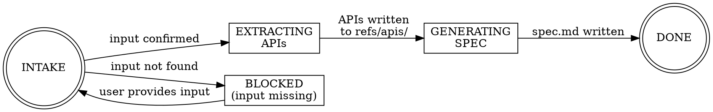

# Analysis — Domain Router

Sequential pipeline that transforms raw inputs into a journey spec (`journeys/<journey>/spec.md`). This router does not implement — it delegates to sub-skills in order.

---

## Pipeline State Machine

| State | Action | Exit → Next |
|---|---|---|
| **INTAKE** | Confirm input exists on disk. Write inline input to `inputs/` if needed. For `.docx` → run `scripts/docx-to-text.py` first. | Input confirmed → EXTRACTING |
| **BLOCKED** | Input file not found or insufficient. Prompt user. | User provides → INTAKE |
| **EXTRACTING** | Scan input for API definitions (inline, attached files, cURL examples). Write each to `refs/apis/<name>.<ext>`. | APIs extracted → GENERATING |
| **GENERATING** | Invoke the appropriate sub-skill to produce `journeys/<journey>/spec.md`. | spec.md written → DONE |
| **DONE** | Return spec path to orchestrator. Orchestrator routes to planner. | — |

---

## Sub-Skill Routing (GENERATING state)

| Input type | Sub-skill |
|---|---|
| Requirements doc, inline text, journey.md | `analyze-requirements` |
| Screenshots, Figma frames, design mockups | `create-screen-doc` (visual analysis mode) |
| v1 AEM Adaptive Form JSON | `analyze-v1-form` |

First match wins. If multiple input types present, start with requirements doc — use visual analysis to fill gaps in screen structure.

---

## Sub-Skills

| # | Skill | Path | Purpose |
|---|---|---|---|
| 1 | `analyze-requirements` | `references/analyze-requirements/SKILL.md` | Parse requirements docs → journey spec |
| 2 | `create-screen-doc` | `references/create-screen-doc/SKILL.md` | Analyze visuals (screenshots, Figma) → journey spec sections |
| 3 | `analyze-v1-form` | `references/analyze-v1-form/SKILL.md` | Read v1 AEM form JSON → journey spec |

---

## Guard Policies

| Policy | Rule |
|---|---|
| `intake-gate` | Confirm input files exist on disk before routing. Never proceed with missing inputs. |
| `no-guessing-endpoints` | Never guess API endpoints. Mark unknowns as `TBD` in spec and `refs/apis/`. |
| `no-currentFormContext` | Never emit `PL.currentFormContext` references. Mark data sources as TBD instead. |
| `spec-convergence` | All paths converge to produce `journeys/<journey>/spec.md`. No sub-skill is done until spec.md is written. |
| `api-extraction-first` | Always extract and write API refs to `refs/apis/` before writing spec.md. Spec references files, not inline schemas. |

---

## File Locations

| Asset | Path |
|---|---|
| Raw input documents | `inputs/` |
| Journey spec | `journeys/<journey>/spec.md` |
| API reference docs | `refs/apis/<name>.<ext>` |
| v1 form JSON | `refs/<form-name>.v1.json` |
| Screenshots / design files | `inputs/<journey>/` or `journeys/<journey>/` |
| `.docx` extraction script | `references/analyze-requirements/scripts/docx-to-text.py` |
