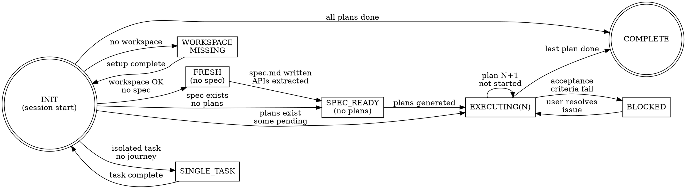

# Orchestrator State Machine

Every session starts with a silent context read. No user prompt until a user-facing action is needed.

---

## State Machine



| State | Condition | Entry Action | Exit → Next State |
|---|---|---|---|
| **INIT** | Session start | Read `handover.md` silently (manage-context READ — no user prompt) | Determine state from table below |
| **WORKSPACE_MISSING** | `FORMS_WORKSPACE` not set, no `.env` | Read `assets/SETUP.md` inline — hard gate, nothing else runs | Setup done → INIT |
| **FRESH** | No `journeys/<j>/spec.md` | Invoke `forms-analysis` | spec.md written + APIs extracted → SPEC_READY |
| **SPEC_READY** | spec.md exists, no plans yet | Invoke `references/planner/SKILL.md` | Plans written to `journeys/<j>/plans/` → EXECUTING(1) |
| **EXECUTING(N)** | Plan N not complete | Execute plan N step by step | Acceptance criteria pass → EXECUTING(N+1) or COMPLETE |
| **BLOCKED** | Plan N acceptance criteria fail | Report to user, await resolution | User resolves → resume EXECUTING(N) |
| **COMPLETE** | All plans ✅ done | Report journey complete to user | Terminal |
| **SINGLE_TASK** | Isolated intent, no journey context | Route to domain via domain registry | Task done → INIT |

---

## INIT — State Determination

After silent `handover.md` read, determine state:

| `handover.md` condition | → State |
|---|---|
| File missing or empty | FRESH |
| `analysis.spec: pending` | FRESH |
| `analysis.spec: done`, no plans generated | SPEC_READY |
| Plans exist, plan N `in-progress` | EXECUTING(N) — resume at last incomplete step |
| Plans exist, plan N-1 `complete`, plan N `not-started` | EXECUTING(N) — start plan N |
| All plans `complete` | COMPLETE |
| User intent is isolated task (no journey) | SINGLE_TASK |

> **Workspace gate (always first):** Before any state transition, verify `FORMS_WORKSPACE` is set or `.env` exists. Missing → WORKSPACE_MISSING. Nothing else runs until workspace is resolved.

---

## Pre-Flight Connectivity Check

Run once per session after workspace confirmed, before first AEM operation. Skip if resuming an active plan mid-execution.

```bash
source .skills-workspace/.env && \
  curl -sf -o /dev/null -H "Authorization: Bearer $AEM_TOKEN" "${AEM_HOST}/api/assets.json" \
  && echo "AEM OK" || echo "AEM FAIL"
```

| Result | Action |
|---|---|
| ✅ AEM OK | Proceed |
| ❌ 401 Unauthorized | Tell user: "AEM bearer token expired. Regenerate from AEM Developer Console → Integrations → Local Token, paste into `.env` as `AEM_TOKEN`." Wait — do not proceed. |
| ❌ Other failure | Diagnose (wrong host, network unreachable). Report with specific action required. Do not proceed until resolved. |

---

## FRESH → SPEC_READY

Invoke `forms-analysis` skill.

| Input type | Handling |
|---|---|
| Requirements doc in `inputs/` | Read directly |
| Inline from user | Write to `inputs/<name>.md` first, then read |
| `.docx` file | Run `scripts/docx-to-text.py` first, then analyze |
| Screenshots / Figma / mockups | Route to `create-screen-doc` for visual analysis |
| v1 AEM form JSON | Route to `analyze-v1-form` |

Outputs written by forms-analysis:
- `journeys/<journey>/spec.md` — journey specification
- `refs/apis/<name>.<ext>` — one file per API found in requirements

---

## SPEC_READY → EXECUTING

Invoke `references/planner/SKILL.md`.

- Input: `journeys/<journey>/spec.md`
- Output: `journeys/<journey>/plans/NN-*.md`

Planner reads spec → identifies which plan types apply → writes numbered plan files in dependency order.

---

## EXECUTING(N) — Plan Execution Flow

```
Read journeys/<journey>/plans/NN-<title>.md
  │
  ▼
Find current step:
  ├── New plan     → first step
  └── Resumed plan → first step where [ ] not ticked
  │
  ▼
Resolve skill via references/domain-registry/SKILL.md
  │
  ▼
Execute step → mark step complete (tick [ ])
  │
  ▼
All steps done?
  ├── No  → next step
  └── Yes → run Acceptance Criteria checks
              ├── All pass → mark plan ✅ complete
              │             offer manage-context WRITE (prompt user)
              │             → EXECUTING(N+1) or COMPLETE
              └── Any fail → BLOCKED → report to user
```

---

## SINGLE_TASK — Domain Fallback

For isolated tasks with no journey context. First match wins.

| Intent | Domain / Skill |
|---|---|
| Analyze requirements, migrate v1, visuals → spec | `forms-analysis` |
| Create form, add / modify / delete fields, panels | `forms-author`, `forms-content-modeler` |
| Custom component, extend field, fd:viewType block | `forms-custom-components` |
| Component inventory, what components exist | `forms-component-inventory` |
| Add rules, show/hide, validate, calculate | `forms-rule-author` |
| Add / build APIs, OpenAPI, cURL | `forms-integration` |
| Save progress, update handover | `forms-context-management` |

No match → ask user to clarify. Never guess.

---

## manage-context Modes

| Mode | Trigger | User Prompt? |
|---|---|---|
| **READ** | INIT — every session start, determine state | ❌ Silent — no announcement, no prompt |
| **WRITE** | After plan completes, user requests save | ✅ Always prompt before writing |
