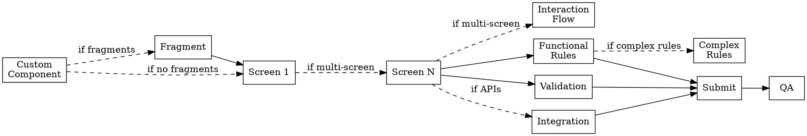

# Planner Guardrails

How to decompose a journey spec into ordered plans. Use when generating plans from `$FORMS_WORKSPACE/journeys/<journey>/spec.md`.

---

## Inputs

| Input | Path | Required |
|---|---|---|
| Journey spec | `$FORMS_WORKSPACE/journeys/<journey>/spec.md` | Yes |
| API reference docs | `$FORMS_WORKSPACE/refs/apis/<name>.<ext>` | If integrations exist |

---

## Plan Type Selection

Read the journey spec and determine which plan types apply:

| Plan Type | Create when spec has... | Skills |
|---|---|---|
| **Custom Component** | `## Custom Components` section with entries | `forms-custom-components` |
| **Fragment** (one per fragment) | `## Fragments` section with entries | `forms-author`, `forms-style-screen` |
| **Screen** (one per wizard step) | Any screen under `## Screens` | `forms-author`, `forms-content-modeler`, `forms-style-screen` |
| **Interaction Flow** | `Screen count: N` where N > 1 (multi-screen journey) | `forms-rule-author` |
| **Functional Rules** | `## Functional Rules` section with entries | `forms-rule-author` |
| **Complex Rules** | `## Complex Rules` section with entries | `forms-rule-author` |
| **Validation** | `## Validations` section with entries | `forms-rule-author` |
| **Integration** | `## Integrations` section with entries | `forms-integration`, `forms-rule-author` |
| **Submit** | `## Submit` section (always present) | `forms-author`, `forms-integration` |
| **QA** | Always — every journey ends with QA | lint + smoke test |

**Always create:** Screen × N, Submit, QA.
**Conditionally create:** all others.

> **Registry check (Custom Component plans only):** Before generating a Custom Component plan, read `$FORMS_WORKSPACE/refs/component-registry.md` (written by `forms-component-discovery` at FRESH startup). If the required component is already registered in the `customComponents` array, no Custom Component plan is needed — reference the existing `fd:viewType` in the Screen plan instead. Only generate a Custom Component plan for genuinely unregistered components.

> **Fragment before Screen:** Fragment plans must complete before any Screen plan that references them. Fragment JSON must exist in the repo before it can be referenced in a host form panel.

---

## Recommended Plan Order



| Order | Plan Type | Dependency |
|---|---|---|
| 0 | **Custom Component** | Nothing (must exist before screens that use it) |
| 0.5 | **Fragment** (one per fragment) | Custom Component (if any); must exist before screens that reference it |
| 1–N | **Screen** (one per wizard step) | Custom Component + Fragment (if any) |
| N+1 | **Interaction Flow** | All Screen plans complete |
| Next | **Functional Rules** | All Screen plans complete |
| Next | **Complex Rules** | Functional Rules |
| Next | **Validation** | All Screen plans complete |
| Next | **Integration** | All Screen plans complete |
| Last-1 | **Submit** | Integration (if any), Validation |
| Last | **QA** | All preceding plans |

> **Adapt, don't force.** Simple single-screen form with no APIs: Screen + Validation + Submit + QA = 4 plans. Only add plan types that the spec requires.

---

## Decomposition Principles

1. **One concern per plan** — each plan targets one functional area. If a plan touches unrelated concerns, split it.
2. **Screen plans include structure and styling** — fields + layout + CSS (`forms-style-screen` runs as last step of each Screen plan). No rules, no APIs, no navigation wiring.
3. **Design references must be copied into screen and fragment plans** — when writing a Screen or Fragment plan, read the `#### Design references` table from that screen's or fragment's entry in `spec.md` and paste it verbatim into the plan's `### Design References` section. If the spec has no design references, write `none` — do not omit the section. This ensures `forms-style-screen` always has a design source to work from without reading back through the spec.
3. **Incremental testability** — after each plan, the form must be in a testable, non-broken state.
4. **Explicit dependencies** — every plan declares which prior plans must be complete.
5. **Max 15 plans per journey** — if more needed, journey is too complex; split it or flag to user.
6. **Read API refs** — for Integration plans, read `$FORMS_WORKSPACE/refs/apis/<name>.<ext>` for endpoint and schema details. Do not duplicate API schema in the plan — reference the file.

---

## Acceptance Criteria — Required in Every Plan

Every plan **must** end with a `## Acceptance Criteria` section. No exceptions.

```markdown
## Acceptance Criteria

- [ ] <Specific observable behavior — not vague>
- [ ] Form loads without console errors
- [ ] No regressions in previously implemented plans
```

**QA plan criteria (thin — covers the full journey):**

```markdown
## Acceptance Criteria

- [ ] `npm run lint` in `$FORMS_EDS_ROOT` exits 0
- [ ] Full journey walkthrough: all screens, happy path, submit succeeds
- [ ] All acceptance criteria from all preceding plans still pass
```

Criteria must be independently testable. "Works correctly" is not a criterion.

> **Plan Completion Gate:** Before marking a plan ✅, the orchestrator MUST verify EVERY
> `- [ ]` criterion against live form state (read AEM page content, check field properties,
> confirm behaviour in rendered form). Marking ✅ based on intent or successful step
> execution alone is forbidden.

---

## Deferred Items

When a plan step defers work to a later plan (e.g. "wired in Plan N", "deferred to Integration plan"):

1. Annotate the step inline: `<!-- deferred to: NN-<plan-title> -->`
2. The orchestrator appends a row to `.agent/handover.md` under `## Deferred Items`:

| Plan | Item | Deferred to | Status |
|------|------|-------------|--------|
| `03-screen-01` | Wire submit button to Integration plan | `07-integration` | ⬚ Pending |

Valid Status values: `⬚ Pending` (not started) → `✅ Done` (resolved).

**Gate:** A plan cannot transition to ✅ until every deferred item targeting it is resolved and its Status updated to ✅ Done.

---

## Plan File Convention

| Property | Convention |
|---|---|
| **Path** | `$FORMS_WORKSPACE/journeys/<journey>/plans/NN-<short-title>.md` |
| **Numbering** | Zero-padded two digits: `01`, `02`, ..., `10`, `11` |
| **Naming** | Lowercase, hyphen-separated: `01-custom-component.md`, `03-screen-01-personal-info.md` |
| **Template** | `assets/TEMPLATE.md` |
| **Max per journey** | 15 |
